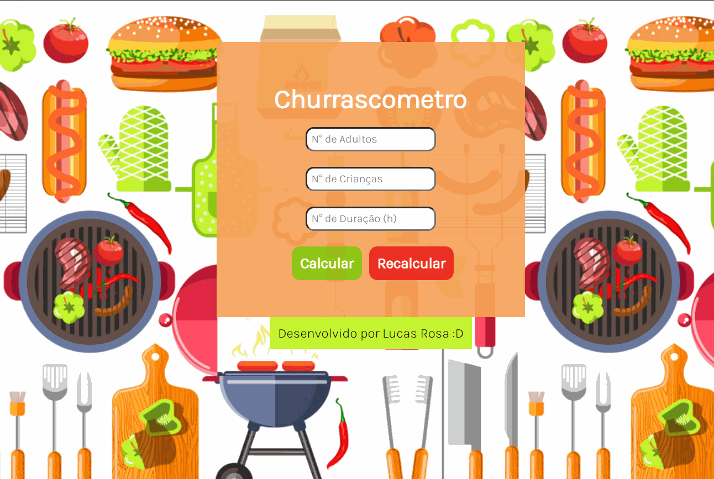
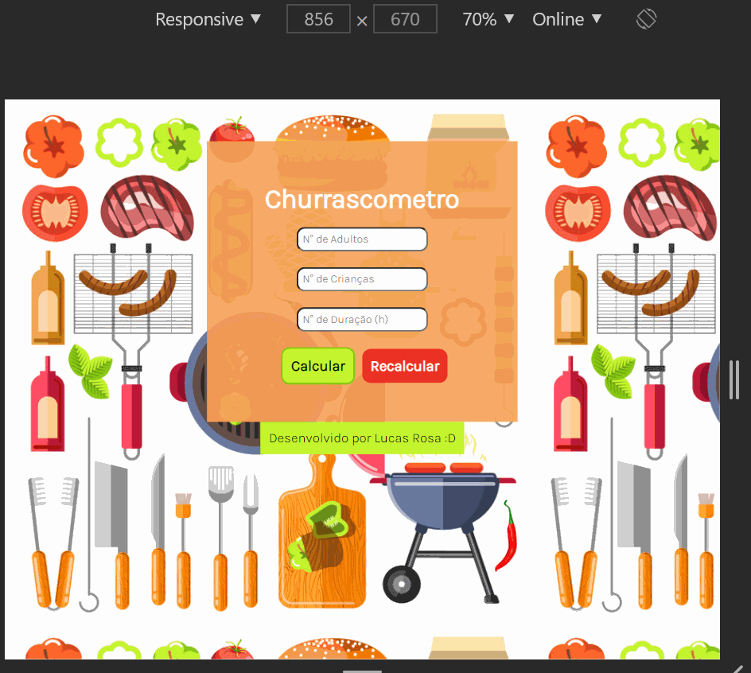

# Churrascometro

### - Nesta aplicação desenvolida em JavaScript, desenvolvi uma ferramenta que calcula quanto de carne, cerveja e bebidas (refrigerante/suco/agua), você precisa para fazer um churrasco entre amigos. Os parametros para o calculo do churrascometro são os seguintes: 

#### *Carne - 400 g por pessoa, se o churrasco durar mais de 6 horas 650g por pessoas.
#### *Cerveja - 1200 ml por pessoa, se o churrasco durar mais de 6 horas 2000 ml por pessoal.
#### *Refrigerante/agua - 1000 ml por pessoa, se o churrasco durar mais de 6 horas 1500 ml por pessoal.
#### *Criança equivale a 1/2 pessoa.

### - Nesta aplicação foram usados as seguintes tecnologias:

#### *HTML.
#### *CSS.
#### *JavaScript

### Front End para desktop

### Front End para celular

### Gostou do meu projeto? :D Entre em contato comigo! 
[Linkedin](https://www.linkedin.com/in/lucas-rosa-058683102/)  
[Email: lucasmetron@gmail.com](mailto:lucasmetron@gmail.com)